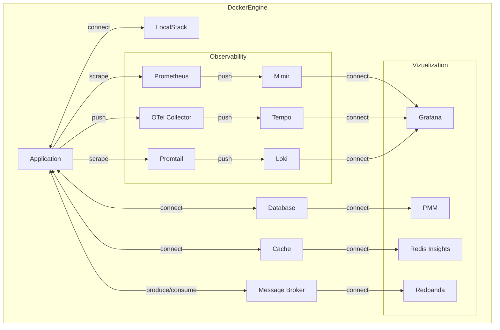

# Containers

This section contains all the containers required to emulate a real infrastructure

## Folder Structure

```bash
.containers
├── broker/
├── cache/
├── database/
├── logs/
├── metrics/
├── provider/
├── traces/
├── vizualization/
├── docker-compose.observability.yaml
└── README.md
```

## Archtecture



### Logs

application -writes-> stdout <-scrape- promtail -pushes-> loki

### Metrics

application <-scrapes- prometheus -pushes-> mimir


[Local Prometheus](http://localhost:9090)


### Traces

application -pushes-> otel-collector -pushes-> tempo

### Vizualization

[Local Grafana](http://localhost:3000)
